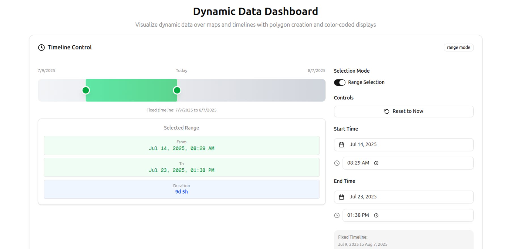
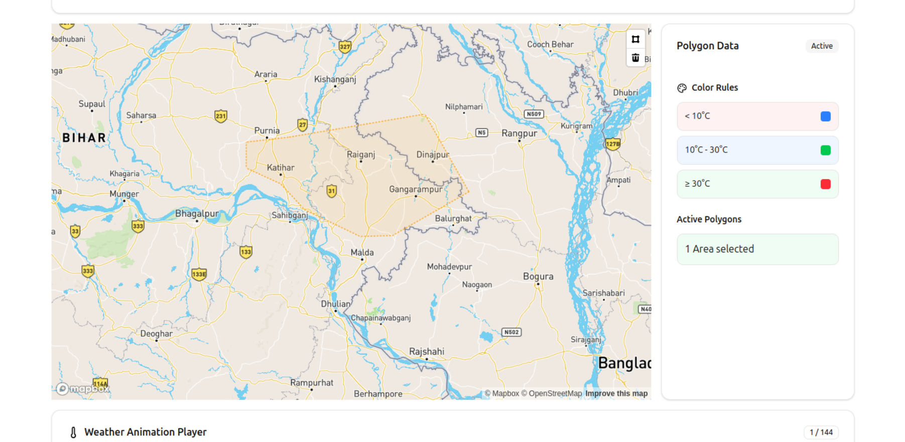
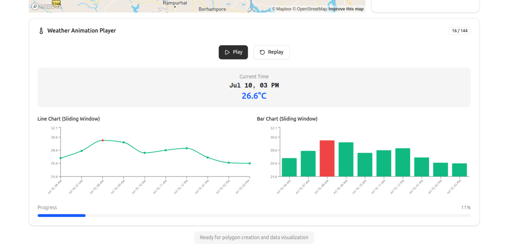

# 🌍 Map Visualizer Dashboard

A dynamic and interactive dashboard built with Next.js and TypeScript to visualize weather data over the past 30 days using a timeline slider and interactive polygon drawing on a map. Users can select a specific date/time range, draw a polygon region on the map, and view temperature trends within that area via graphs.

## 🔗 Deployed Application

Visit the live version here:  
[https://map-visualizer-olive.vercel.app/](https://map-visualizer-olive.vercel.app/)

---

## 🚀 Setup and Run Instructions

### 1. Clone the Repository

```bash
git clone https://github.com/1008surajshaw/MapVisualizer.git
cd MapVisualizer
````

### 2. Install Dependencies

```bash
npm install
```

### 3. Setup Environment Variables

Create a `.env` file in the root directory and add your Mapbox access token:

```env
NEXT_PUBLIC_MAPBOX_ACCESS_TOKEN=your_mapbox_token_here
```

> 🔑 **How to get your Mapbox token:**
>
> * Go to [https://www.mapbox.com/](https://www.mapbox.com/)
> * Sign up and verify your email
> * Add your billing address and card details
> * Navigate to your account dashboard
> * Copy the public access token and paste it into `.env`

### 4. Run the Application

```bash
npm run dev
```

The app will start locally at: [http://localhost:3000](http://localhost:3000)

---

## 🧱 Tech Stack

* **Framework**: Next.js + TypeScript
* **State Management**: Zustand
* **Map Library**: Mapbox GL JS + Mapbox Draw
* **UI Components**: shadcn/ui (built on Radix UI)
* **Graphing**: Recharts (Line + Bar Graphs)
* **Date Utilities**: date-fns
* **Other Tools**: Turf.js (for geospatial calculations)

---

## 📦 Dependencies

### Runtime

* `mapbox-gl`
* `@mapbox/mapbox-gl-draw`
* `@turf/turf`
* `zustand`
* `recharts`
* `clsx`
* `lucide-react`
* `tailwind-merge`
* `react-day-picker`
* `@radix-ui/react-*`

### Dev

* `@types/mapbox-gl`
* `@types/mapbox__mapbox-gl-draw`
* `@types/react-window`
* `@tailwindcss/postcss`
* `typescript`
* `eslint`
* `tw-animate-css`

---

## 📊 Features

* View past 30-day hourly temperature data
* Single or range-based timeline slider
* Interactive Mapbox map with polygon drawing (3 to 12 points)
* Area and centroid calculation of drawn polygon
* Weather data fetched from Open-Meteo API using centroid
* Play, pause, reset functionality on slider
* Graphical view using bar and line charts
* Current location detection and caching
* Zoom in/out support (bonus feature)

---

## 📷 Screenshots 





---

## ✅ Completed Requirements

* ✅ Timeline slider with hourly resolution and range/single mode
* ✅ Interactive Map with polygon draw support
* ✅ Weather data fetched via Open-Meteo API
* ✅ Polygon coloring based on data rules
* ✅ Data graphing using charts
* ✅ Zoom & pan map support
* ✅ State management with Zustand
* ✅ Cached user location and polygon state

---

## 📌 Remarks

* Polygon data is stored in global Zustand store for cross-component access.
* Color rules and multiple datasets can be added for future enhancements.
* API data is based on polygon centroid and averages temperature over the selected range.
* Optimized for performance using memoized state slices and efficient draw handling.
* Graph color change according to the rule ( less that 10 blue , between 10-30 green , and more that 30 red ) .


